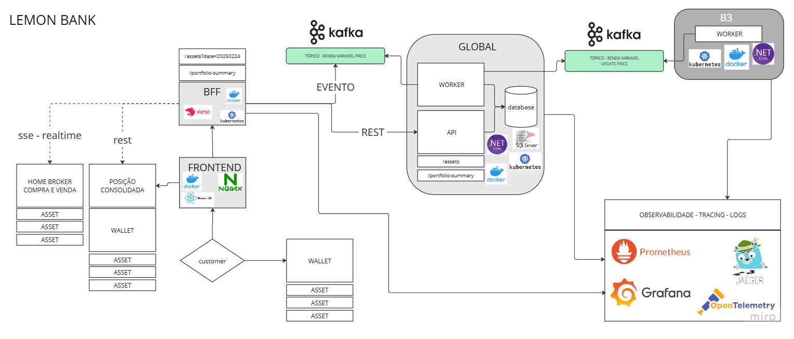

# 💰 Bem Vindos a corretora LEMON BANK 💰

## Project Architecture



# Lemon Bank - B3 Market Data Producer

This project simulates a market data producer that generates stock market data and sends it to Kafka. It's part of a larger system that processes financial market data.

## Project Structure

```
lemon-bank/
├── b3/                    # .NET Core service that produces market data
│   ├── Worker.cs         # Background service that generates and sends market data
│   ├── Program.cs        # Application entry point
│   ├── appsettings.json  # Configuration file
│   └── Dockerfile        # Docker configuration for the .NET service
├── docker-compose.yml    # Docker Compose configuration
└── README.md             # This file
```

## Services

The system consists of the following services:

1. **b3** - .NET Core service that:
   - Generates simulated market data
   - Sends data to Kafka
   - Runs as a background service

2. **Kafka** - Message broker that:
   - Receives market data from the b3 service
   - Stores messages in topics
   - Runs on port 9092 (external) and 29092 (internal)

3. **Zookeeper** - Required by Kafka for:
   - Cluster coordination
   - Configuration management
   - Runs on port 2181

4. **Kafka UI** - Web interface for:
   - Monitoring Kafka topics
   - Viewing messages
   - Managing Kafka
   - Accessible at http://localhost:8080

## Prerequisites

- Docker
- Docker Compose

## Running the Project

1. Clone the repository:
   ```bash
   git clone <repository-url>
   cd lemon-bank
   ```

2. Start all services using Docker Compose:
   ```bash
   docker-compose up
   ```

3. Access the services:
   - Kafka UI: http://localhost:8080
   - Kafka broker: localhost:9092

## Development

### Building the .NET Service

The b3 service is automatically built by Docker Compose. However, if you need to build it separately:

```bash
cd b3
dotnet build
```

### Environment Variables

The following environment variables are used:

- `ASPNETCORE_ENVIRONMENT`: Set to "Development" in docker-compose.yml
- `Kafka__BootstrapServers`: Set to "kafka:29092" for internal Docker network communication

## Monitoring

You can monitor the system using:

1. **Kafka UI** (http://localhost:8080):
   - View topics
   - Monitor messages
   - Check consumer groups

2. **Docker Logs**:
   ```bash
   docker-compose logs -f b3
   ```

## Stopping the Services

To stop all services:

```bash
docker-compose down
```

## Troubleshooting

If you encounter connection issues:

1. Ensure all containers are running:
   ```bash
   docker-compose ps
   ```

2. Check container logs:
   ```bash
   docker-compose logs
   ```

3. Verify Kafka is accessible:
   ```bash
   docker-compose exec kafka kafka-topics --list --bootstrap-server localhost:9092
   ```

# Global Service Documentation

## Overview

The Global service is a .NET 8.0 worker service that acts as a Kafka consumer, processing market data messages from the B3 service. It's designed to be part of a distributed system for financial market data processing.

## Project Structure

```
global/
├── Worker.cs              # Main service implementation
├── Program.cs             # Application entry point
├── global.csproj          # Project configuration
├── appsettings.json       # Configuration file
├── appsettings.Development.json  # Development-specific settings
├── Dockerfile            # Container configuration
└── Properties/           # Project properties
```

## Dependencies

The project uses the following key packages:
- Microsoft.Extensions.Hosting (8.0.0) - For worker service implementation
- Confluent.Kafka (2.3.0) - For Kafka integration

## Configuration

The service is configured through:
- `appsettings.json` - Main configuration file
- Environment variables
- User secrets (configured in global.csproj)

Key configuration settings:
- `Kafka:BootstrapServers` - Kafka broker address (default: "kafka:29092")
- `ASPNETCORE_ENVIRONMENT` - Environment setting (Development/Production)

## Main Components

### Worker Service

The `Worker` class implements a background service that:
1. Connects to Kafka using the specified configuration
2. Subscribes to the "test-topic" topic
3. Consumes messages in a continuous loop
4. Processes received messages
5. Commits offsets after successful processing
6. Handles errors and graceful shutdown

### Message Processing

The service currently:
- Logs received messages
- Provides a structure for custom message processing
- Supports JSON deserialization of messages
- Implements proper error handling and logging

## Running the Service

### Local Development

1. Ensure Kafka is running (via docker-compose)
2. Build and run the service:
   ```bash
   cd global
   dotnet run
   ```

### Docker Deployment

The service can be run in a container:
```bash
docker-compose up global
```

## Monitoring

The service provides logging for:
- Message consumption
- Processing errors
- Service lifecycle events

Logs can be viewed through:
- Console output
- Docker logs
- Application Insights (if configured)

## Best Practices

1. **Error Handling**
   - Implements proper exception handling
   - Logs errors with context
   - Continues processing after recoverable errors

2. **Resource Management**
   - Properly disposes of Kafka consumer
   - Implements graceful shutdown
   - Manages connection lifecycle

3. **Configuration**
   - Uses environment-specific settings
   - Supports user secrets for sensitive data
   - Provides default values for required settings
